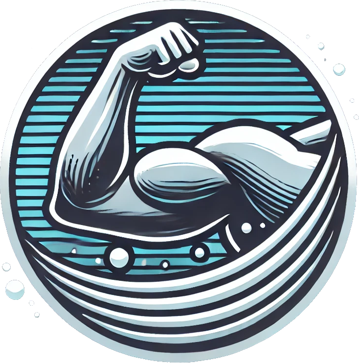

<a id="readme-top"></a>

<!-- PROJECT SHIELDS -->
[![Contributors][contributors-shield]][contributors-url]
[![Forks][forks-shield]][forks-url]
[![Stargazers][stars-shield]][stars-url]
[![Issues][issues-shield]][issues-url]
[![MIT License][license-shield]][license-url]
[![LinkedIn][linkedin-shield]][linkedin-url]


<!-- PROJECT LOGO -->
<br />
<div align="center">
  <a href="https://github.com/marcelolerendegui/buff">
    
  </a>

  <h3 align="center">BUFF: BUbble Flow Field</h3>

  <p align="center">
    Ultrasound Simulation Framework
    <br />
    <a href="https://github.com/marcelolerendegui/buff/examples">Examples</a>
    ·
    <a href="https://github.com/marcelolerendegui/buff/issues/new?labels=bug&template=bug_report_template.md">Report a Bug</a>
    ·
    <a href="https://github.com/marcelolerendegui/buff/issues/new?labels=enhancement&template=feature_request_template.md">Request a Feature</a>
  </p>
</div>

<!-- TABLE OF CONTENTS -->
<details>
  <summary>Table of Contents</summary>
  <ol>
    <li>
      <a href="#about-the-project">About The Project</a>
    </li>
    <li>
      <a href="#getting-started">Getting Started</a>
      <ul>
        <li><a href="#requirements">Requirements</a></li>
        <li><a href="#installation">Installation</a></li>
      </ul>
    </li>
    <li><a href="#usage">Usage</a></li>
    <li><a href="#roadmap">Roadmap</a></li>
    <li><a href="#authors">Authors</a></li>
    <li><a href="#license">License</a></li>
    <li><a href="#contact">Contact</a></li>
    <li><a href="#acknowledgments">Acknowledgments</a></li>
  </ol>
</details>

<!-- ABOUT THE PROJECT -->
## About The Project

BUFF will be released on 2024, in the meantime, here's the preprint:
[BUbble Flow Field: a Simulation Framework for Evaluating Ultrasound Localization Microscopy Algorithms](https://arxiv.org/abs/2211.00754)

**BUFF** is a comprehensive open-source simulation platform designed to validate **Ultrasound Localization Microscopy (ULM)** algorithms. This tool generates contrast-enhanced ultrasound images within vascular tree geometries that mimic realistic flow characteristics, facilitating the testing and validation of ULM techniques using ground truth data. 

The framework is primarily implemented in **MATLAB** with some parts in **Python**. It's designed to support researchers and engineers working in areas like vector flow imaging, functional ultrasound, and super-resolution ULM.

## Key Features
- **Vascular Network Generation**: Create complex, microvascular networks, either randomly generated or user-defined.
- **Blood Flow Simulation**: Fast fluid solver for realistic blood flow simulation with custom pressures and arbitrary input/output positions.
- **Microbubble Dynamics**: Simulate non-linear microbubble behavior with a range of point spread functions based on user-defined MB characteristics.
- **Acoustic Field Simulation**: Combine acoustic field simulations with MB dynamics to generate ultrasound images.
- **Validation Metrics**: Perform both binary and quantitative validation of ULM algorithms using built-in metrics.
- **Ground Truth Generation**: Ideal for objective, quantitative evaluation of localization and tracking algorithms.
  
**BUFF** was demonstrated at the [**Ultrasound Localization and Tracking Algorithms for Super Resolution (ULTRA-SR) Challenge**](https://ultra-sr.com) at the **IEEE International Ultrasonics Symposium (IUS) 2022**, providing ULM images with ground truth data for evaluating localization and tracking algorithms.

<!-- GETTING STARTED -->
## Getting Started

### Requirements
To use BUFF, you will need the following prerequisites:

- **MATLAB** (recommended version: 2021a or later)
- **FieldII** (simulation backend)
- **Python** (for specific modules)

### Installation
Clone the repository:

```bash
git clone https://github.com/marcelolerendegui/buff.git
```

Download the backend ([FieldII](https://field-ii.dk)) and extract it:

```bash
curl -O 'https://field-ii.dk/program_code/matlab_2021/Field_II_ver_3_30_linux.tar.gz' \
  -H 'User-Agent: Mozilla/5.0 (X11; Linux x86_64)' \
  -H 'Upgrade-Insecure-Requests: 1'

mkdir -p third_party/Field_II_ver_3_30_linux
tar -xvzf Field_II_ver_3_30_linux.tar.gz -C third_party/Field_II_ver_3_30_linux/
```

<!-- USAGE EXAMPLES -->
## Usage

Currently, the code is in its alpha state. While we work on adding tutorials and more documentation, here’s a basic outline to get started:

### Examples


 - [Cyst Example](examples/cyst/README.md)
 - [Cross-Tube Example](examples/cross_tube/README.md)

Load a vascular network model (either random or user-defined).
Define blood flow parameters and simulate using the CFD solver.
Simulate microbubble dynamics and acoustic fields.
Run validation algorithms on the generated ultrasound images.
Detailed examples and tutorials will be available soon to demonstrate specific workflows.


<!-- AUTHORS -->
## Authors

<table>
  <tr>
    <td align="center">  </td>
    <td align="center">  </td>
  </tr>
  <tr>
    <td> <a href="https://github.com/marcelolerendegui">Marcelo Lerendegui</a> </td>
    <td> <a href="https://github.com/KR616">Kai Riemer</a> </td>
  </tr>
</table>

### Contributors:
- Joe Hansen-Shearer [joseph.hansen-shearer18@imperial.ac.uk](mailto:joseph.hansen-shearer18@imperial.ac.uk)
- Bingxue Wang [bingxue.wang18@imperial.ac.uk](mailto:bingxue.wang18@imperial.ac.uk)
- Clara Rodrigo Gonzalez [clara.rodrigo-gonzalez18@imperial.ac.uk](mailto:clara.rodrigo-gonzalez18@imperial.ac.uk)

<!-- contributor images
*** <a href="https://github.com/marcelolerendegui/buff/graphs/contributors">
***   
*** </a>
-->

We welcome contributions to improve the platform! If you encounter any issues or have suggestions for new features, please open an issue.


<!-- LICENSE -->
## License

Distributed under the MIT License. See `LICENSE.txt` for more information.

<p align="right">(<a href="#readme-top">back to top</a>)</p>

<!-- CONTACT -->
## Contact

- Marcelo Lerendegui: [marcelo@lerendegui.com](mailto:marcelo@lerendegui.com)
- Kai Riemer: [kr616@ic.ac.uk](mailto:kr616@ic.ac.uk)
- Meng-Xing Tang - [mengxing.tang@imperial.ac.uk](mailto:mengxing.tang@imperial.ac.uk)


<p align="right">(<a href="#readme-top">back to top</a>)</p>

<!-- ACKNOWLEDGMENTS -->
## Acknowledgments

BUFF was developed at [ULIS] (https://tanglab.bg.ic.ac.uk)
<br /><sub><a href="https://tanglab.bg.ic.ac.uk">ULIS: Ultrasound Laboratory for Imaging and Sensing</a></sub>


* [FieldII](https://field-ii.dk/)


<p align="right">(<a href="#readme-top">back to top</a>)</p>

<!-- MARKDOWN LINKS & IMAGES -->
<!-- https://www.markdownguide.org/basic-syntax/#reference-style-links -->
[contributors-shield]: https://img.shields.io/github/contributors/marcelolerendegui/buff.svg?style=for-the-badge
[contributors-url]: https://github.com/marcelolerendegui/buff/graphs/contributors
[forks-shield]: https://img.shields.io/github/forks/marcelolerendegui/buff.svg?style=for-the-badge
[forks-url]: https://github.com/marcelolerendegui/buff/network/members
[stars-shield]: https://img.shields.io/github/stars/marcelolerendegui/buff.svg?style=for-the-badge
[stars-url]: https://github.com/marcelolerendegui/buff/stargazers
[issues-shield]: https://img.shields.io/github/issues/marcelolerendegui/buff.svg?style=for-the-badge
[issues-url]: https://github.com/marcelolerendegui/buff/issues
[license-shield]: https://img.shields.io/github/license/marcelolerendegui/buff.svg?style=for-the-badge
[license-url]: https://github.com/marcelolerendegui/buff/blob/master/LICENSE.txt
[linkedin-shield]: https://img.shields.io/badge/-LinkedIn-black.svg?style=for-the-badge&logo=linkedin&colorB=555
[linkedin-url]: https://linkedin.com/in/marcelo-lerendegui

[product-screenshot]: images/screenshot.png
