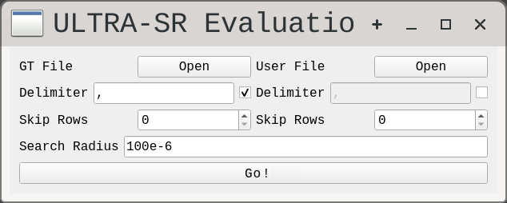
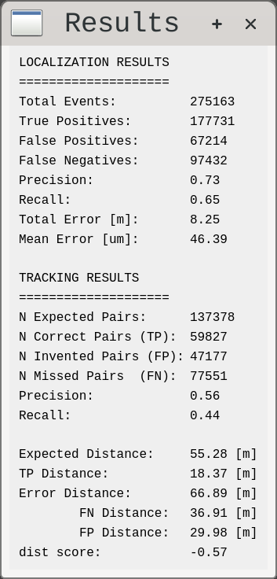

# Evaluation of Localization and Tracking

## Installation

```bash
pip install -r requirements.txt
```

## Run

### No Graphic Interface

Run no_gui.py script with the appropiate file paths, delimiters, skiprows, and search radius.

```bash
python src/no_gui.py --gt_path PATH_TO_GROUND_TRUTH --data_path PATH_TO_DATA --delimiter "," --skiprows 1 --radius 500e-6
```

The results will be printed to the standard output.

### Graphic Interface

From command line:

```bash
python src/gui.py
```

will open the main gui:



Select the appropiate appropiate file paths, delimiters, skiprows, and search radius.
Press the "Go!" button and the results window will pop-up when analysis is done.


