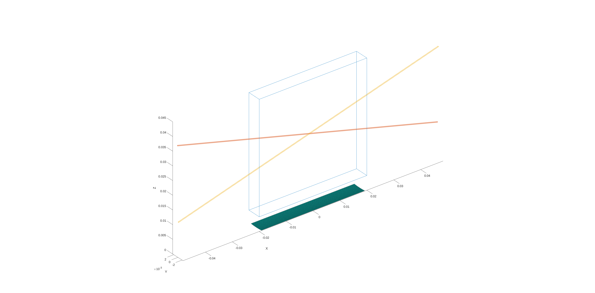
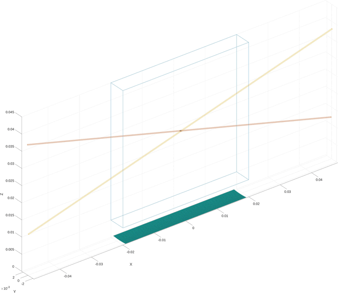

# Cross Tube Example

This example script demonstrates the simulation a cross tube phantom BUFF, an ultrasound simulation library. The script creates a phantom two micro tubes with a diameter of 210um.

## Script Overview

### Setup

The setup section creates all the geometric objects in the scene.
It consists of a Box representing the whole phantom, with two Tubes that cross at an angle, and an L11-4v transducer.

```matlab
%% Setup
space = Box( ...
        [0, 0, 25*mm], ...              % Center
        [40*mm, 5*mm, 40*mm], ...       % Size
        [0, 0, 0] ...                   % Rotation
);

tube1 = Tube( ...
        [0, 0.2*mm, 25*mm], ...         % Center
        [0.21*mm, 0.21*mm, 100*mm], ... % Size
        [0, 105, 0] ...                 % Rotation
);

tube2 = Tube( ...
        [0, -0.2*mm, 25*mm], ...        % Center
        [0.21*mm, 0.21*mm, 100*mm], ...	% Size
        [0, 75, 0] ...                  % Rotation
);

transducer = L11_4V();
angles = linspace(-6, 6, 3);
```

### Scene Display

This secion is straight forward, it just plots all the elements in the scene.
In order to keep the tube plot clean of scatterers, they are ploted using the plot_boundary function.

```matlab
%% Display Scene

hf = figure();
ha = axes();
hold(ha, 'on');
space.plot_skeleton(ha);
tube1.plot_boundary(ha);
tube2.plot_boundary(ha);
% tube1.plot(ha); # plots boundary, random scats and obj axis
% tube2.plot(ha); # plots boundary, random scats and obj axis
transducer.tx_aperture.plot_aperture(ha);
axis equal;
```

<p>

</p>

### Scatterer Source Definition

This section defines two *ScattererSource* objects, which regions in space that generate scatterers with a speficied average rate.
The *SonovueScattererSource* objects used for this example generate microbubbles with random radii and parameters fitted for SonoVue.

```matlab
%% Scatterer Sources
% A ScattererSource is a region in space that generates scatterers randomly
% The number of scatterers generated in a time interval follows a Poisson
% distribution, with a specified average rate.
% In this case the generated bubbles will have the Sonovue parameters (with
% random radii distribution).

t1_src_g = Tube( ...
        tube1.center - 50*mm * tube1.e3, ...
        [0.21*mm, 0.21*mm, 1*mm], ...   % Size
        [0, 105, 0] ...                 % Rotation
);

t2_src_g = Tube( ...
        tube2.center - 50*mm * tube2.e3, ...
        [0.21*mm, 0.21*mm, 1*mm], ...	% Size
        [0, 75, 0] ...                  % Rotation
);


t1_bub_src = SonovueScattererSource( ...
                t1_src_g, ... % Region in space
                25/s ... % Average Rate
);

t2_bub_src = SonovueScattererSource( ...
                t2_src_g, ... % Region in space
                25/s ... % Average Rate
);
``

### Linear Scatterers

In this secion, linear scatterers are generated and simulated. These scatterers represent the material the tube is made from, and are used as 'background' scatterers.

```matlab
nscats = 50000;
lin_scats_t1 = LinearScatterers(tube1.random_surface_points(nscats), randn(nscats,1));
lin_scats_t2 = LinearScatterers(tube2.random_surface_points(nscats), randn(nscats,1));

lin_scats = lin_scats_t1 + lin_scats_t2;

line_scat_rf = transducer.tx_rx_angles(lin_scats, angles);

save('line_scat_rf.mat', 'line_scat_rf', '-v7.3')
clear line_scat_rf;
```

### Pre-Fill the tubes

Normally the pre-fill would be done all at once using the *random_volume_point* functions available for all geometry objects.
In this example we do the pre-fill in timesteps only for the sake of creating an animation of how the simulation process works.

```matlab
%% Pre-Sim
% We populate microbubbles for 500 frames to pre-fill the tubes
% Instead of populating at once using the geometry's random_volume_points,
% we do it frame by frame to display the process with a nice animation.

dt = 0.01;
nframes = 500;

t1_bubs = t1_bub_src.generate(1, tube1.center); % generate one bubble first 
t2_bubs = t2_bub_src.generate(1, tube2.center); % generate one bubble first

% Plot bubbles
t1_bubs.plot(ha,'k*');
t2_bubs.plot(ha,'ko');

for fn = 1:nframes
    
    t1_bubs = t1_bubs + t1_bub_src.step(dt);
    t2_bubs = t2_bubs + t2_bub_src.step(dt);

    % update bubbles
    if (t1_bubs.count > 0)
        % calc velocity based on the position in the tube and update
        % positions
        t1_bubs.pos = t1_bubs.pos + 30*mm/s .* velocity_in_tube(tube1, t1_bubs.pos).* dt;
        % delete bubbles that are outside the tube
        idx_out = tube1.is_outside(t1_bubs.pos);
        t1_bubs.delete(idx_out);
    end
    
    if (t2_bubs.count > 0)
        % calc velocity based on the position in the tube and update
        % positions
        t2_bubs.pos = t2_bubs.pos + 30*mm/s .* velocity_in_tube(tube2, t2_bubs.pos).* dt;
        % delete bubbles that are outside the tube
        idx_out = tube2.is_outside(t2_bubs.pos);
        t2_bubs.delete(idx_out);
    end
    
    % Update plot
    delete(ha.Children(1)); % delete last 2 plots
    delete(ha.Children(1)); % delete last 2 plots
    t1_bubs.plot(ha,'k*'); % replot
    t2_bubs.plot(ha,'ko'); % replot
    drawnow;
    pause(dt);
end
```

The result of this loop is two tubes filled with microbubbles, and a nice animation.
<p>

</p>

## Rest of the script

The rest of the script works in the same way as the pre-fill, but running a simulation with each frame.


