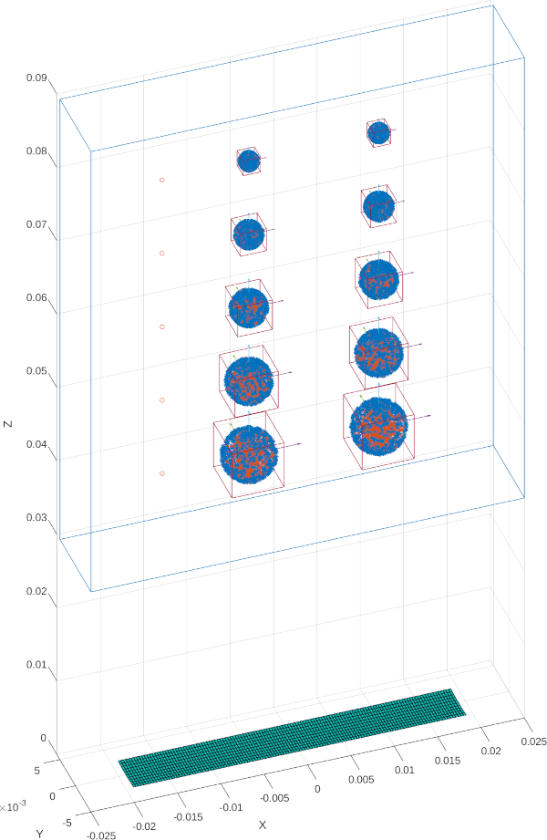
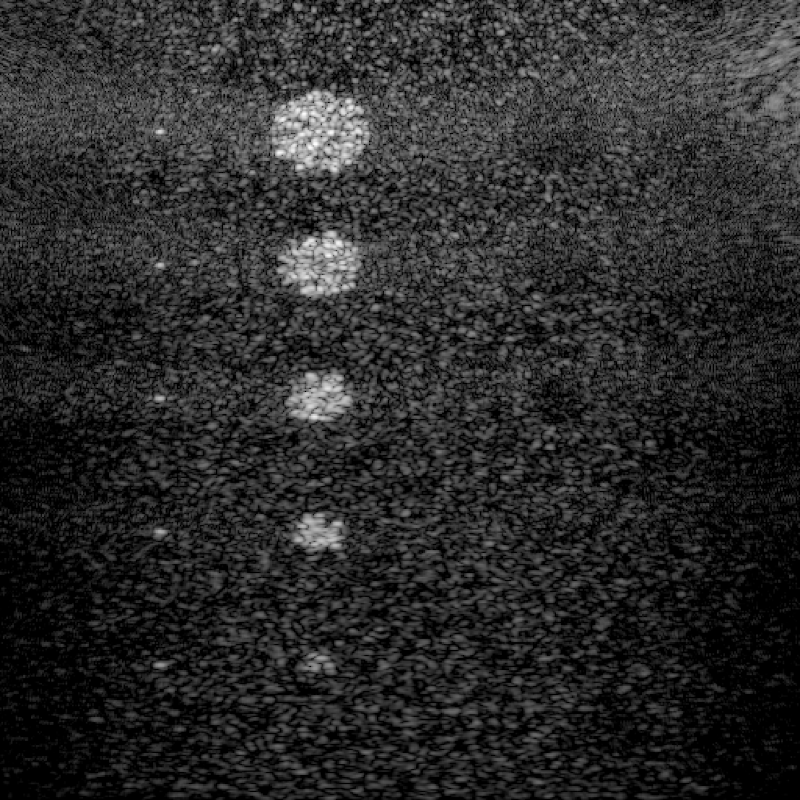

# Cyst Phantom Example

This example script demonstrates the simulation of a cyst phantom using BUFF, an ultrasound simulation library. The script creates a phantom with multiple cysts and high-scattering regions of varying sizes, simulates ultrasound imaging, and displays the results.

## Script Overview

The script performs the following steps:

1. Initializes the environment and sets up the transducer (L11_4V).
2. Defines the imaging space and phantom geometry:
   - Creates cysts of sizes 2mm, 3mm, 4mm, 5mm, and 6mm.
   - Creates high-scattering regions of the same sizes.
3. Generates random scatterers in the imaging space.
4. Modifies scatterer amplitudes to create cysts and high-scattering regions.
5. Adds point scatterers to the phantom.
6. Displays the scene geometry.
7. Simulates ultrasound transmission and reception.
8. Performs beamforming on the received RF data.
9. Creates and displays the final ultrasound image.

## Key Components

- `L11_4V()`: Function to create the transducer object.
- `Box` and `Ellipsoid`: Classes to define the geometries used in the phantom. `Box` is used for the imaging space and `Ellipsoid` for the cysts.
- `LinearScatterers`: A list of linear scatterers, comprised of positions and scattering amplitudes.
- `beamform_delays` and `beamform`: Functions for cpu beamforming. beamform_delays pre-calculates all the delays, and beamform uses de delays and interpolation to do the beamforming.
- `clip_dynamic_range`: Function to adjust the dynamic range of the output image.

## Output

The script produces two figures:
1. A visualization of the phantom geometry, including cysts, high-scattering regions, and the transducer position:

2. The simulated ultrasound image of the phantom:

## Customization

You can modify the following parameters to experiment with different phantom configurations:
- Cyst and high-scattering region sizes and positions
- Number and distribution of scatterers
- Imaging angles and space dimensions
- Beamforming parameters

## Note

This script is provided as an example and may require adjustments based on your specific BUFF and Field II setups.
Ensure all dependancies are installed and all paths are correctly set before running the script.

